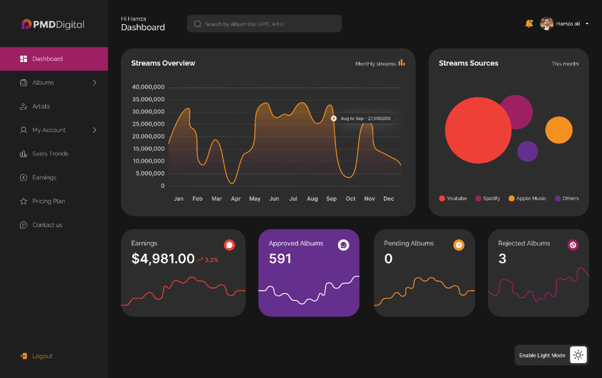

# MoonPower 🌑

A modern, high-performance SaaS landing page with a focus on dark mode aesthetics and 3D interactivity.

Built from scratch to explore the intersection of **React**, **Three.js**, and **Tailwind CSS**.



## ✨ Highlights

- **Immersive 3D Hero**: Custom-built with React Three Fiber.
- **Dark Purple Theme**: A consistent, accessible color system designed for low-light environments.
- **Responsive & Fast**: Optimized for all devices using Vite.
- **Modern Components**: Bento grids, glassmorphism, and shader-powered backgrounds.

## 🛠️ Built With

- **Core**: React 18, TypeScript, Vite
- **Styling**: Tailwind CSS, Lucide Icons
- **Motion**: Framer Motion, React Three Fiber (R3F)

## 🚀 Running Locally

1. **Clone the repo**
   ```bash
   git clone https://github.com/akhileshdasari2004/moon_power_landingpage.git
   cd moon_power_landingpage
   ```

2. **Install dependencies**
   ```bash
   npm install
   ```

3. **Start the dev server**
   ```bash
   npm run dev
   ```

## 🚢 Build

```bash
npm run build
```

---
*Built with 💜*
